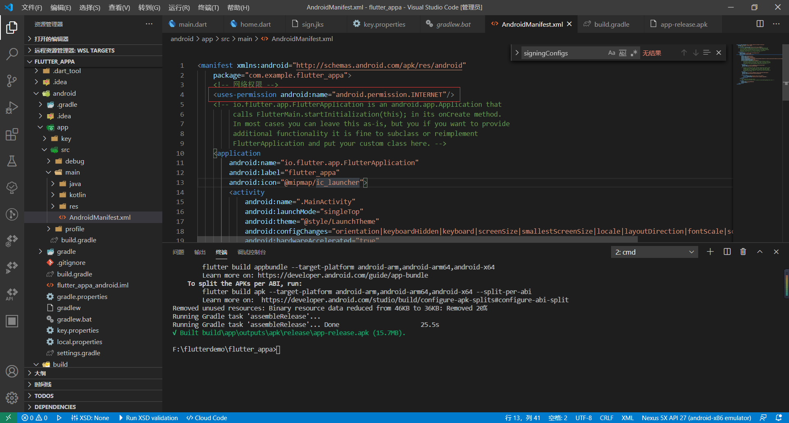
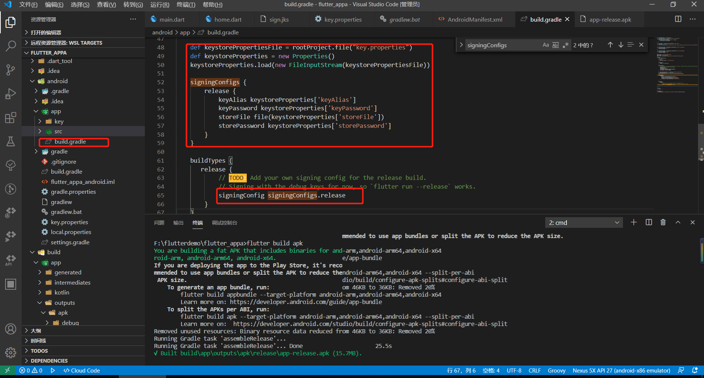

# flutter 打包

## android

### 修改 android/app/src/main/AndroidManifest.xml

>需要请求网络 添加`<uses-permission android:name="android.permission.INTERNET"/>`这个可以不修改



### 添加证书

>`keytool -genkey -v -keystore ./sign.jks -keyalg RSA -keysize 2048 -validity 10000 -alias sign`创建证书
>`keytool -list -v -keystore F:\APP\sign.jks -alias sign -storepass 123456 -keypass 123456` 查看证书  sign、storepass、keypass 分别为： 别名、密钥库密码、 sign文件密码

### 导入证书

>在Flutter工程中/android/app/key/sign.jks创建该目录
>在Flutter工程中/android/key.properties 创建该文件,添加如下内容`key.properties`

```test
storePassword=123456
keyPassword=123456
keyAlias=sign
storeFile=key/sign.jks
```

>配置/android/app/build.gradle文件,添加证书然后改为release正式环境

```gradle
android {
    /*添加证书*/
    signingConfigs {
        release {
            keyAlias 'sign'
            keyPassword 'android'
            storeFile file('key/sign.jks')
            storePassword 'android'
        }
    }
/*打包类型修改为正式*/
    buildTypes {
        release {
            signingConfig signingConfigs.release
        }
    }
}
```

或者使用下面的更好 android节点下添加以下内容

```gradle
    def keystorePropertiesFile = rootProject.file("key.properties")
    def keystoreProperties = new Properties()
    keystoreProperties.load(new FileInputStream(keystorePropertiesFile))

    signingConfigs {
        release {
            keyAlias keystoreProperties['keyAlias']
            keyPassword keystoreProperties['keyPassword']
            storeFile file(keystoreProperties['storeFile'])
            storePassword keystoreProperties['storePassword']
        }
    }

    buildTypes {
       release {
            // TODO: Add your own signing config for the release build.
            // Signing with the debug keys for now, so `flutter run --release` works.
            signingConfig signingConfigs.release
        }
    }
```



### 打包

>在当前项目目录的终端中执行：`flutter build apk` 或者直接在 Android Studio 的 Terinal 执行命令
>当前项目\build\app\outputs\apk\release\xx.apk
>>>aab打包 `# 运行 flutter build appbundle。 (运行 flutter build 默认构建一个发布版本。) flutter build appbundle`


