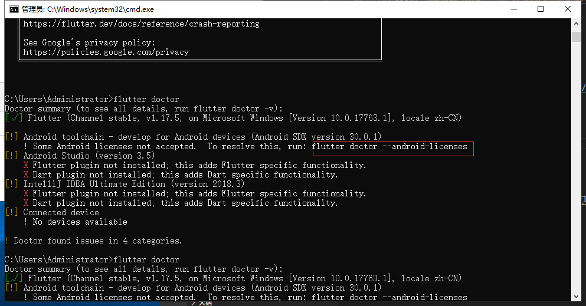
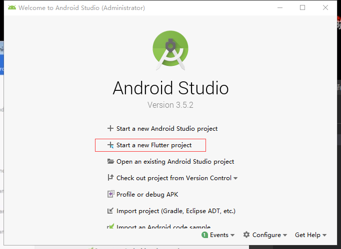

# 基础环境搭建

## java jdk配置

>下载javajdk
>jdk8以上没有jre
>>cd 到jdk目录
>>执行cmd`bin\jlink.exe --module-path jmods --add-modules java.desktop --output jre`
>jdk/bin和jre/bin目录添加到环境变量 'JAVA_HOME'

## 安装android studio软件

>傻瓜式下一步
>安装成功后选择conffigure>SDK Manger 选择jdk的安装目录安装
>添加path 'ANDROID_HOME' 默认`C:\Users\Administrator\AppData\Local\Android\Sdk`
>>添加path
>>>%ANDROID_HOME%\platform-tools;
>>>%ANDROID_HOME%\emulator;
>>>%ANDROID_HOME%\tools;
>>>%ANDROID_HOME%\tools\bin;
>`adb -v`

## 安装Flutter SDK [下载](https://flutter.dev/docs/get-started/install/windows)

>下载
>解压到固定文件夹下
>添加path `D:\flutter\bin`
>`flutter -v`

## 配置镜像 `https://flutter.cn/`

>添加path
>>FLUTTER_STORAGE_BASE_URL: https://storage.flutter-io.cn
>>PUB_HOSTED_URL: https://pub.flutter-io.cn

## 检查环境是否配置成功 `flutter doctor`

执行`flutter doctor --android-licenses` 一路y再`flutter doctor`
>添加android studio插件`configure>plugins` 搜索flutter 然后它会提示是否装dart(选择yes),安装成功后他会提示你重启，选择重启

此时就会有flutter模块

## 创建项目

>傻瓜式的下一步，选择你的fluttersdk然后继续傻瓜式的下一步，开始创建时候会比较慢，等一会
>选择flie>open>选择android项目，然后需要等待很长时间（编译gradle）
>手机开启开发者模式>开启usb调试>连接电脑
>run项目

## vscode启动flutter
>下载插件`dart`和`flutter`以及`Flutter Widget Snippets`语法提示插件
>打开flutter项目
>flutter run (前提是已经插入调试机器或者启动虚拟机（vscode右下角可查或者查看>命令面板>flutter dev）)
